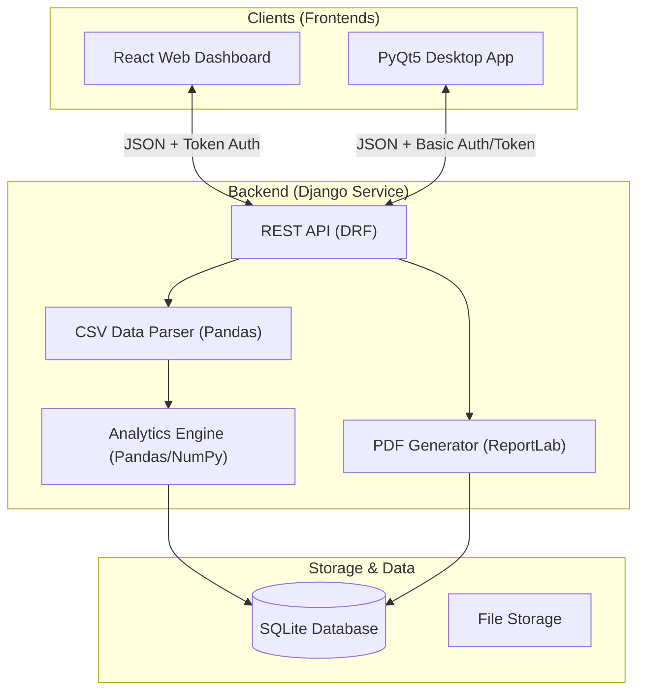

# ChemViz Pro: Industrial Telemetry Analytics Suite
### Intern Screening Task – Hybrid Web + Desktop Application

[](https://www.python.org/)
[](https://www.djangoproject.com/)
[](https://reactjs.org/)
[](https://vitejs.dev/)
[](https://www.riverbankcomputing.com/software/pyqt/)

ChemViz Pro is a sophisticated full-stack industrial analytics platform designed for real-time monitoring, visualization, and health assessment of chemical plant equipment. It provides a seamless bridge between raw telemetry data and actionable executive insights through its premium web and desktop interfaces.

Developed by **Aerin Patel** for the Intern Screening Task.

---

## Architecture

The system follows a modern decoupled architecture, with a centralized Django REST API serving both web and desktop clients.



---

## Key Features

### 1. Unified Backend API
- **Django REST Framework**: Built a robust API layer for seamless data flow.
- **Data Handling**: Leverages **Pandas** for high-speed CSV parsing and analytical computation.
- **Intelligent Health Scores**: Custom algorithms detect equipment health based on telemetry deviations.

### 2. Multi-Platform Experience
- **Premium Web Frontend (React + Chart.js)**:
  - State-of-the-art interface utilizing glassmorphism and fluid animations (Framer Motion).
  - Dynamic charts including Doughnut (distribution), Bar (critical watchlist), and Line (telemetry trends).
- **High-Performance Desktop Frontend (PyQt5 + Matplotlib)**:
  - Professional engineering-grade UI.
  - Native performance with integrated Matplotlib plotting.

### 3. Advanced Analytics & Reporting
- **History Management**: Stores and summarizes the last 5 datasets for trend comparison.
- **Executive Reporting**: Automated PDF generation using **ReportLab**, featuring system health summaries and critical watchlist annotations.
- **Visual Analytics**: Correlation charts between Pressure, Flowrate, and Temperature.

### 4. Enterprise Security
- **Authentication**: Token-based authentication for the Web client and Basic/Token integration for the Desktop client.
- **Secure Persistence**: Session management with `localStorage`.

---

## Tech Stack

- **Backend**: Python Django, Django REST Framework, Pandas, SQLite.
- **Frontend (Web)**: React.js, Vite, Tailwind CSS, Chart.js, Framer Motion.
- **Frontend (Desktop)**: PyQt5, Matplotlib, Requests.
- **Reporting**: ReportLab (PDF Generation).

---

## Getting Started

### 1. Clone & Setup Backend
```bash
cd backend
python -m venv venv
venv\Scripts\activate
pip install -r requirements.txt
python manage.py migrate
python manage.py runserver
```

### 2. Launch Web Dashboard
```bash
cd frontend-web
npm install
npm run dev
```

### 3. Launch Desktop Application
```bash
cd frontend-desktop
pip install -r requirements.txt
python main.py
```

---

## API Endpoints

| Endpoint | Method | Description |
| :--- | :--- | :--- |
| `/api/auth/login/` | POST | Authenticates user and returns access token. |
| `/api/datasets/upload/` | POST | Uploads telemetry CSV and triggers analysis. |
| `/api/datasets/history/` | GET | Returns the last 5 analysis results. |
| `/api/reports/<id>/pdf/` | GET | Generates/Downloads a professional PDF report. |

---

## Sample Data Format
The application expects a CSV with the following columns:
`Equipment Name`, `Type`, `Flowrate`, `Pressure`, `Temperature`

---

Built with precision and dedication by **Aerin Patel**.
